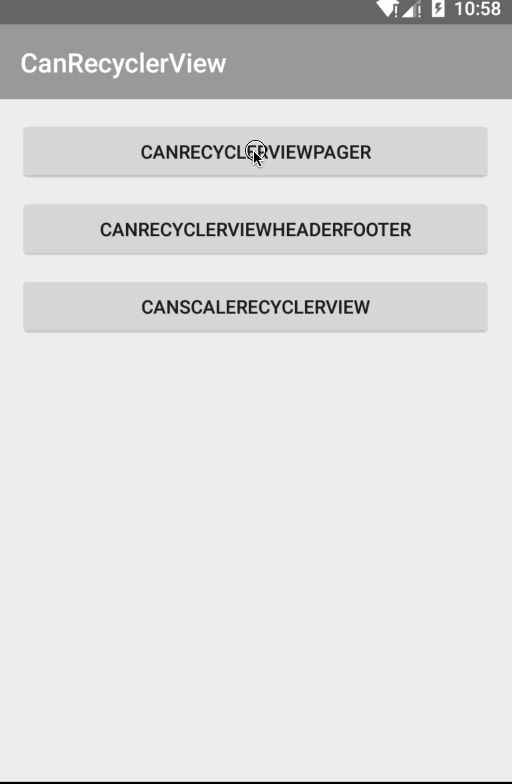

# CanRecyclerView
一个RecyclerView的扩展使用库。可以扩展为viewpager使用，可以为RecyclerView设置emptyView，可以使其不可滚动，嵌入scrollvew中使用，等等。

此项目参考了[RecyclerViewPager](https://github.com/lsjwzh/RecyclerViewPager)。


  


## 使用方式 
**1.CanRecyclerView**  
CanRecyclerViewPager是用RecyclerView实现的ViewPager，主要方法setOnePage是否只滑动一页，setFriction设置摩擦系数，addScaleListener其中传入一个浮点型，使其有缩放效果，setTabLayoutSupport方法可使其支持TabLayout。
RecyclerViewEmpty是一个可监听RecyclerView是否为空的扩展实现。主要方法setEmptyView(View emptyView)，在adapter为空时可显示emptyView。


**2.代码示例**  
Demo中使用了[CanAdapter](https://github.com/canyinghao/CanAdapter)，使用方式请自行查阅。
```JAVA
public class MainActivity extends Activity {

    @Bind(R.id.toolbar)
    Toolbar toolbar;
    @Bind(R.id.tabLayout)
    TabLayout tabLayout;
    @Bind(R.id.viewpager)
    CanRecyclerViewPager viewpager;

    Activity context;

    @Override
    protected void onCreate(Bundle savedInstanceState) {
        super.onCreate(savedInstanceState);
        setContentView(R.layout.activity_main);
        ButterKnife.bind(this);
        context = this;
        toolbar.setTitle(R.string.app_name);


        initViewPager();
    }

    protected void initViewPager() {

        final int[] colors = {R.color.report_color1, R.color.report_color2, R.color.report_color3, R.color.report_color4};
        viewpager = (CanRecyclerViewPager) findViewById(R.id.viewpager);
        LinearLayoutManager layout = new LinearLayoutManager(this, LinearLayoutManager.HORIZONTAL,
                false);
        viewpager.setLayoutManager(layout);
        CanRVAdapter adapter = new CanRVAdapter<MainBean>(viewpager, R.layout.item_main) {

            @Override
            protected void setView(CanHolderHelper helper, int i, MainBean bean) {
                helper.getConvertView().setBackgroundResource(colors[i]);

                if (i == 0 || i == 1) {
                    helper.setVisibility(R.id.scrollView, View.GONE);
                    helper.setVisibility(R.id.rv_item2, View.VISIBLE);
                } else {
                    helper.setVisibility(R.id.scrollView, View.VISIBLE);
                    helper.setVisibility(R.id.rv_item2, View.GONE);
                }


                final CanRVAdapter adapterItem = new CanRVAdapter<MainBean>(viewpager, R.layout.item_3) {

                    @Override
                    protected void setView(CanHolderHelper helper, int i, MainBean bean) {

                        helper.setText(R.id.tv_title, bean.mText);
                        helper.setText(R.id.tv_content, bean.mText);
                    }

                    @Override
                    protected void setItemListener(CanHolderHelper helper) {

                    }
                };

                for (int j = 0; j < 20; j++) {
                    adapterItem.addLastItem(new MainBean("this is itme " + j));
                }


                RecyclerViewEmpty rv_item1 = helper.getView(R.id.rv_item1);
                RecyclerViewEmpty rv_item2 = helper.getView(R.id.rv_item2);

                LinearLayoutManager layout = null;

                switch (i) {

                    case 0:
                        layout = new LinearLayoutManager(context, LinearLayoutManager.VERTICAL,
                                false);

                        rv_item2.setLayoutManager(layout);
                        rv_item2.addItemDecoration(new HorizontalDividerItemDecoration.Builder(context).colorResId(R.color.line).size(10).showLastDivider().build());
                        rv_item2.setEmptyView(helper.getView(R.id.empty));
                        rv_item2.setAdapter(adapterItem);
                        adapterItem.setOnItemListener(new CanOnItemListener() {
                            public void onRVItemClick(ViewGroup parent, View itemView, int position) {

                                adapterItem.removeItem(position);
                                App.getInstance().show("deleteItem:" + position);

                            }


                        });
                        break;
                    case 1:

                        layout = new LinearLayoutManager(context, LinearLayoutManager.VERTICAL,
                                false);
                        rv_item2.setLayoutManager(layout);
                        rv_item2.addItemDecoration(new HorizontalDividerItemDecoration.Builder(context).colorResId(R.color.line).size(5).showLastDivider().build());
                        rv_item2.setEmptyView(helper.getView(R.id.empty));
                        rv_item2.setAdapter(adapterItem);

                        adapterItem.clear();
                        adapterItem.addLastItem(new MainBean("点击删除"));
                        adapterItem.setOnItemListener(new CanOnItemListener() {
                            public void onRVItemClick(ViewGroup parent, View itemView, int position) {

                                adapterItem.clear();


                            }


                        });
                        break;
                    case 2:

                        layout = new FullyGridLayoutManager(context,
                                2);
                        rv_item1.addItemDecoration(new HorizontalDividerItemDecoration.Builder(context).colorResId(R.color.line).size(5).showLastDivider().build());
                        rv_item1.addItemDecoration(new VerticalDividerItemDecoration.Builder(context).colorResId(R.color.line).size(5).showLastDivider().build());

                        rv_item1.setLayoutManager(layout);
                        rv_item1.setAdapter(adapterItem);
                        break;
                    case 3:

                        layout = new FullyLinearLayoutManager(context, LinearLayoutManager.VERTICAL,
                                false);
                        rv_item1.addItemDecoration(new HorizontalDividerItemDecoration.Builder(context).colorResId(R.color.color_main).size(2).showLastDivider().build());

                        rv_item1.setLayoutManager(layout);
                        rv_item1.setAdapter(adapterItem);
                        break;
                }


            }

            @Override
            protected void setItemListener(CanHolderHelper helper) {

            }


        };
        adapter.setRatio(1);

        viewpager.setAdapter(adapter);

        viewpager.setHasFixedSize(true);
        viewpager.setLongClickable(true);
        viewpager.setOnePage(true);
        viewpager.addScaleListener(0.9f);

        adapter.addLastItem(new MainBean("xxx"));
        adapter.addLastItem(new MainBean("xxx"));
        adapter.addLastItem(new MainBean("xxx"));
        adapter.addLastItem(new MainBean("xxx"));


        viewpager.addOnPageChangedListener(new CanRecyclerViewPager.OnPageChangedListener() {
            @Override
            public void OnPageChanged(int oldPosition, int newPosition) {
                Log.e(CanRecyclerViewPager.TAG, "oldPosition:" + oldPosition + " newPosition:" + newPosition);
                App.getInstance().show("oldPosition:" + oldPosition + " newPosition:" + newPosition);
            }
        });


        final String[] array_list = getResources().getStringArray(R.array.array_list);

        viewpager.setTabLayoutSupport(tabLayout, new CanRecyclerViewPager.ViewPagerTabLayoutAdapter() {
            @Override
            public String getPageTitle(int position) {
                return array_list[position];
            }

            @Override
            public int getItemCount() {
                return array_list.length;
            }
        });

    }
}
```


### 开发者

 

canyinghao: <canyinghao@hotmail.com>  


### License

    Copyright 2016 canyinghao

    Licensed under the Apache License, Version 2.0 (the "License");
    you may not use this file except in compliance with the License.
    You may obtain a copy of the License at

       http://www.apache.org/licenses/LICENSE-2.0

    Unless required by applicable law or agreed to in writing, software
    distributed under the License is distributed on an "AS IS" BASIS,
    WITHOUT WARRANTIES OR CONDITIONS OF ANY KIND, either express or implied.
    See the License for the specific language governing permissions and
    limitations under the License.
